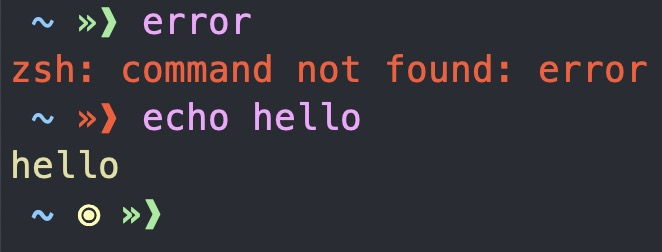
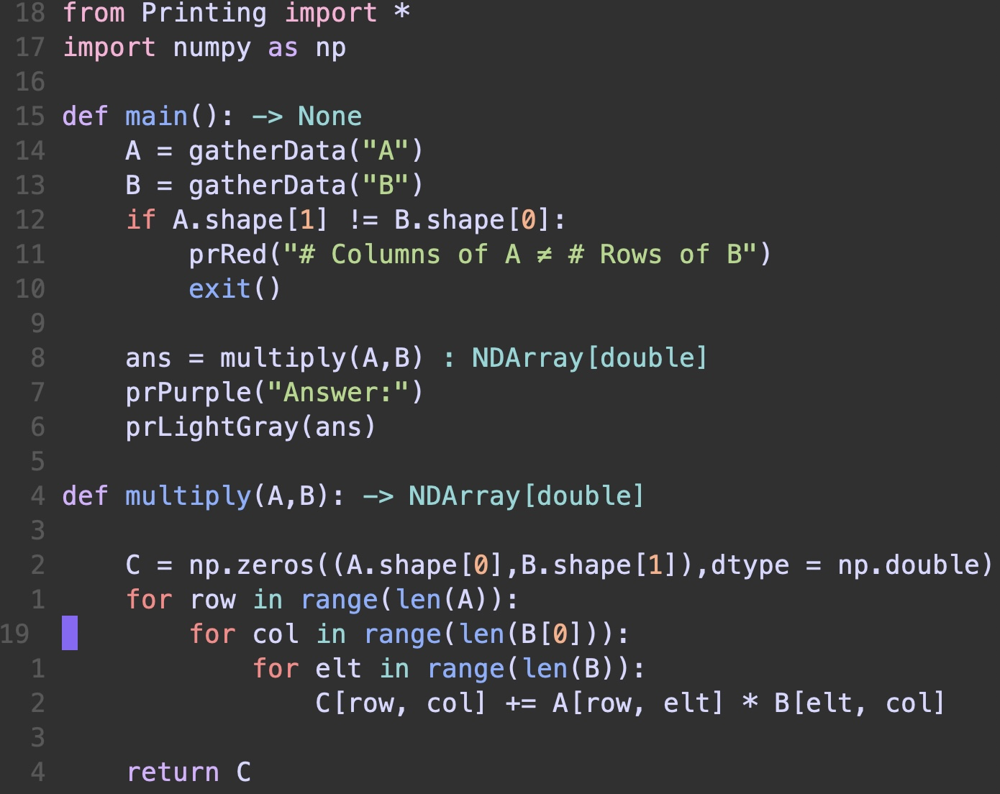

### Dotfiles
These are my dotfiles for zsh, nvim and obsidian.

#### Shell Prompt (no [oh-my-zsh](https://ohmyz.sh))

- error text is red
- indicator on the current line

#### Example Python Code in NVIM

