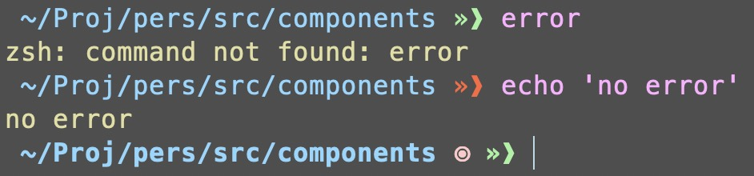
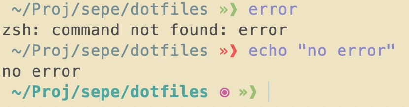
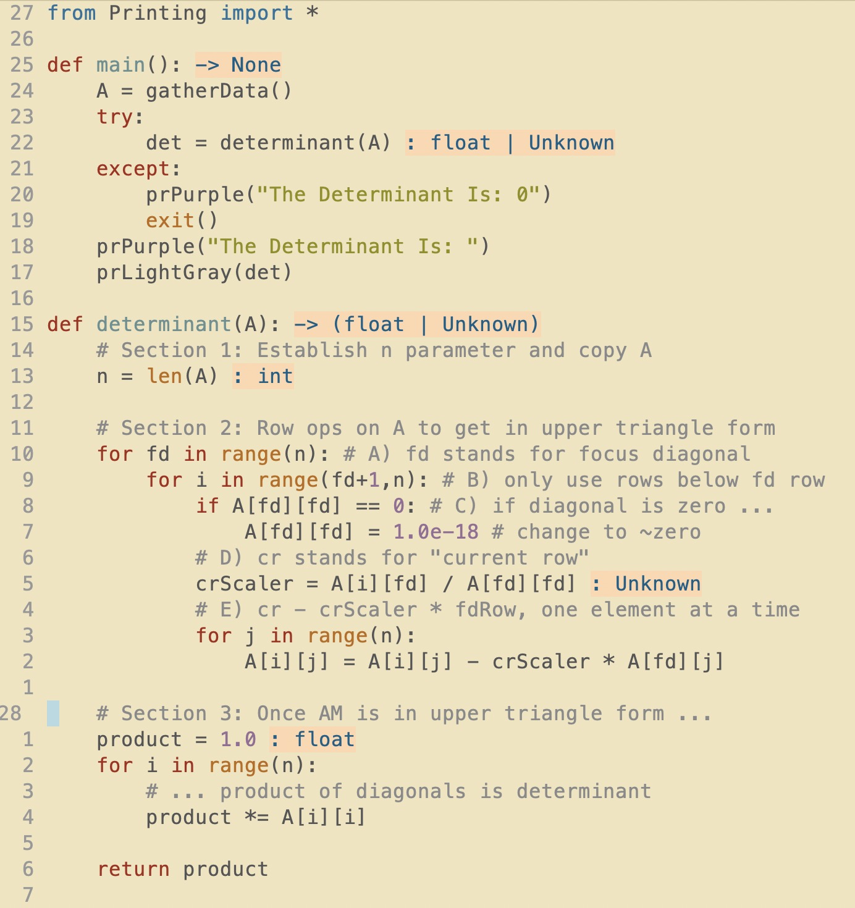

### Dotfiles
These are my dotfiles for zsh, nvim and obsidian.

#### Shell Prompt (no [oh-my-zsh](https://ohmyz.sh))
**Dark Mode**

**Light Mode**

**Features**

- parent directories are truncated to four characters
    - the above image has the working directory *$HOME/Projects/personal_website/src/components*
- arrow becomes red if previous command raised an error
- indicator on the current line
- current prompt is bolded previous aren't

#### Example Python Code in NVIM
**Dark Mode**

**Light Mode**

